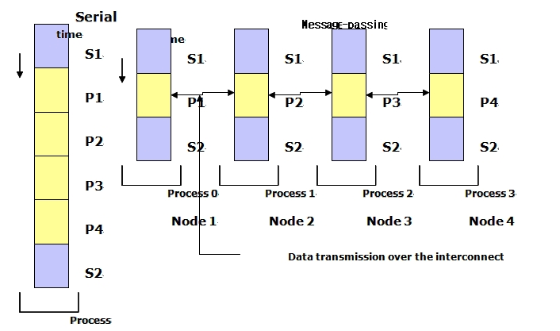
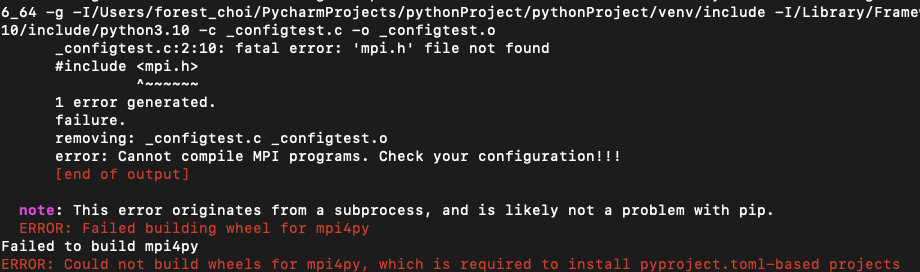
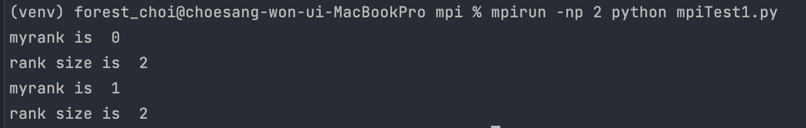

# MPI vs openMP

# [파이썬(Python) :: 기본개념편] 병렬처리 하는방법! (빅데이터분석) MPI vs. openMP 비교!

MPI : Message Passing Interface



병렬 컴퓨팅 환경에서 지역적으로 메모리를 따로 가지는 노드들이 데이터를 공유를 위한 통신규약

주로 분산 메모리 시스템과 클러스터 컴퓨팅 환경에서 사용되며, 프로세스 간의 통신을 위한 라이브러리와 함수들을 제공

일단 python에서 MPI를 사용하여 병렬처리를 하기 위해서는 mpi4py 패키지를 설치해야한다.

ubuntu에 개발환경이 없으면 설치가 안될 수 있음



이런 오류가 나온다면

```jsx
sudo apt-get install mpich ( ubuntu )

brew install mpich ( mac )

MS-MPI 설치( window )
```

각 운영체제에 맞게 대처하면된다.

```jsx
pip install mpi4py
```

---

Rank 확인하기 : Get Rank()

우선 communicator 라는걸 정의해야 하는데 기본 세팅인 MPI.COMM_WORLD사용한다.

이 커뮤니케이터는 모든 프로세스들로 구성되어 있고, 파이썬 MPI 코드에서는 메인 커뮤니케이터가 필요하다. 하지만, MPI.COMM_WORLD 내에 프로세서들의 부분집합을 사용해서 Custom 커뮤니케이터를 만들 수도 있다.

```python
from mpi4py import MPI

def main():
    comm = MPI.COMM_WORLD

    myrank = comm.Get_rank()
    rank_size = comm.Get_size()

    print("myrank is ", myrank)
    print("rank size is ", rank_size)

if __name__ == '__main__':
    main()
```



이 코드를 mpirun을 통해 실행시키고 -np 2 옵션을 주면 ,2개의 cpu를 사용해서 동일한 코드를 돌릴 수 있다.

Get_size()는 현재 할당돤 총 cpu의 개수를 알 수 있다..

```python
from mpi4py import MPI

def main():
    comm = MPI.COMM_WORLD

    myrank = comm.Get_rank()
    rank_size = comm.Get_size()

    if (myrank == 0):
        print("I will do dishwashing, says A with rank ", myrank)
        print("World size is ", rank_size)

    if (myrank == 1):
        print("I will do clothes folding, says B with rank ", myrank)
        print("World size is ", rank_size)

if __name__ == '__main__':
    main()
```

위와같이 myrank에 따라 코드를 다르게 실행 시킬 수 있따.

---

For문 병렬처리

for문을 돌릴 때 계산시간이 오래걸리면, 해당 반복문을 잘게 쪼개는 형태로 병렬처리할 수 있다.

MPI가 아닌 openMP를 사용하면 보다 쉽게 병렬처리를 할 수 있으나, MPI가 성능적으로 더욱 효과적이다.

클러스터를 사용하지 않고 본인컴퓨터의 여러 CPU를 사용하여 병렬처리하는 경우, 큰차이는 없지만, openMP는 공유하는 메모리 공간에서 쪼개어 데이터 처리를 하기 때문에, 데이터 간의 커뮤니케이션 상에 오류가 발생할 가능성이있다. MPI는 완전히 독립된 공간 내에 독립된 데이터를 처리하기 때문에 위험 자체가 존재하지 않는다.

```python
x = [] 
for i in range(100):
    x.append(i)
    
print(x)
```

위 코드를 병렬로 처리한다면,

```python
import time

from mpi4py import MPI

def main():
    comm = MPI.COMM_WORLD
    start = time.time()

    myrank = comm.Get_rank()
    world_size = comm.Get_size()

    data_count = 100
    part_size = int(data_count / world_size)
    print(part_size)

    i_start = myrank * part_size
    i_end = i_start + part_size

    if (myrank == (world_size - 1)):
        i_end = data_count

    x = []
    for i in range(i_start, i_end):
        x.append(i)

    print("My Rank = ", myrank, len(x), print(x))

    time_end = time.time()
    print("Total time taken = ", (time_end - start))

    gathered_x = comm.gather(x, root=0)
    if (myrank == 0):
        print(gathered_x)

if __name__ == '__main__':
    main()

```

할당된 cpu core에 따라 다른 작업을 할 수 있게 해준다.

---

```python
import time

from mpi4py import MPI

# mpirun -np 2 python sendRecvTest.py
# mpirun -np 3 python sendRecvTest.py
def main():
    comm = MPI.COMM_WORLD
    start = time.time()

    my_rank = comm.Get_rank()
    world_size = comm.Get_size()

    if (my_rank == 0):
        print(my_rank)
        comm.send("hello receiver1", dest=1)
        comm.send("hello receiver2", dest=2)

    if (my_rank == 1):
        print(my_rank)
        data = comm.recv(source=0)
        print(data)

    if (my_rank == 2):
        print(my_rank)
        data = comm.recv(source=0)
        print(data)

if __name__ == '__main__':
    main()

-------------------------------------------------------------------

import time

from mpi4py import MPI

# mpirun -np 2 python sendRecvTest.py
# mpirun -np 3 python sendRecvTest.py
def main():
    comm = MPI.COMM_WORLD
    start = time.time()

    my_rank = comm.Get_rank()
    world_size = comm.Get_size()
    count = 0
    if (my_rank == 0):
        print(my_rank, "sender")
        comm.send(30, dest=1)
        comm.send(20, dest=2)

    if (my_rank == 1):
        data = comm.recv(source=0)
        print(my_rank, "-", my_rank * data)
        count = my_rank * data

    if (my_rank == 2):
        data = comm.recv(source=0)
        print(my_rank, "-", my_rank * data)
        count = my_rank * data

    count_x = comm.gather(count, root=0)
    if (my_rank == 0):
        print(sum(count_x))

if __name__ == '__main__':
    main()
```

이렇게하면 0번 cpu가 sender 1,2번이 receiver가 된다.